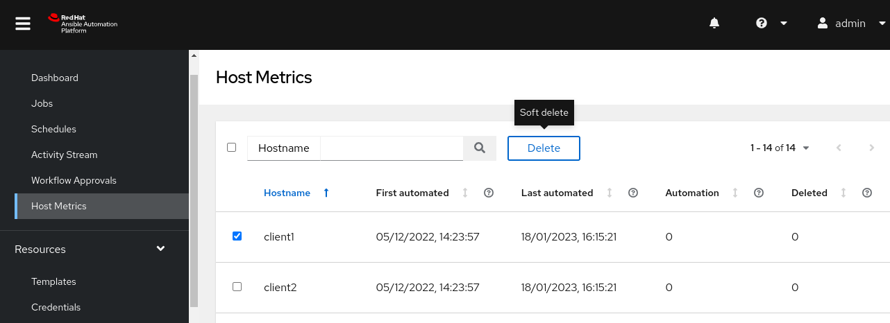
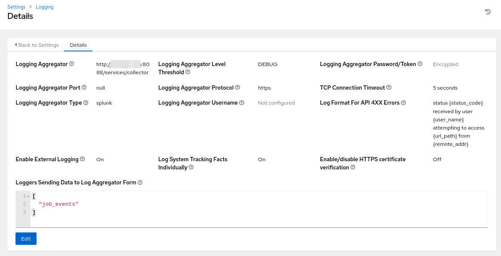
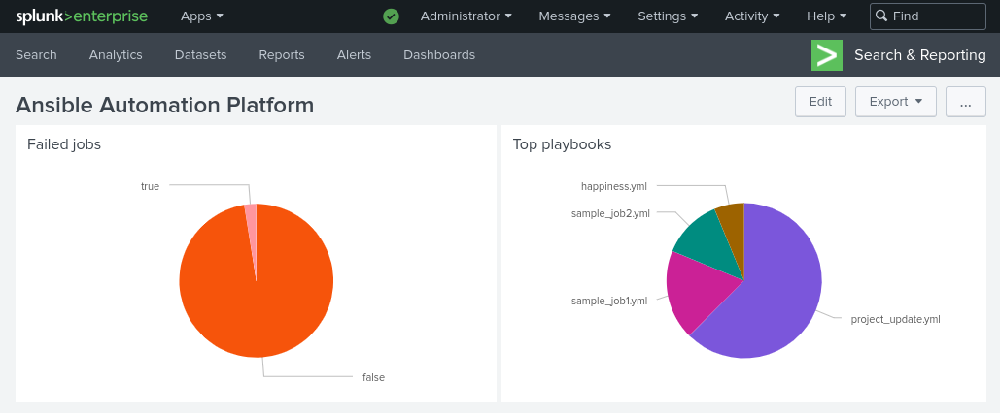

# Ansible Automation Platform [demo runbook]

## Template launch

Use case: start a simple automation playbook

Business Value: instead of manual actions, recurring tasks are now automated in a controlled manner.

## Workflow launch

UC: we can tie multiple playbooks together (sometimes owned and maintained by different teams) in a single workflow. We can also integrate workflows inside workflows. Workflows can be made of playbooks but also approval, inventory sync or project sync.

BV: Teams collaborate together to build advanced automation.

## RBAC

UC: We want to apply a least privileges approach to who can run what.

BV: Risk reduction.

## Dynamic Inventories

UC: instead of managing inventories manually, an operator that is highly error prone, we configure AAP to retrieve the nodes to manage from an source of thruth inventory.

BV: We reduce the risk of running automation on the wrong machines.

## Smart Inventories

UC: we can group machines from multiple inventories in single "smart inventories" based on the properties of the machines (properties called "facts"). The smart inventories can be used for ad hoc automation tasks such as upgrades.

BV: Grouping machines together in inventories and RBAC allow to delegate automation to specific teams (e.g. allow the projectX team to run automation on the development environment of the projectX).

## Constructed inventories

UC: we can group machines from multiple inventories based on variables.

BV: same as smart inventories

https://www.ansible.com/blog/how-to-use-the-new-constructed-inventory-feature-in-aap-2.4

## API endpoints

UC: the Ansible Automation Platform can be integrated with third party tools, such as ITSM platforms.

BV: ITSM implementation

## Start a workflow from ServiceNow

UC: a user order a service that is fullfiled automatically

BV: ITSM implementation

## Job with survey

UC: surveys allow automation engineers to create forms that can be delegated to users.

BV: when the organization doesn't have an ITSM platform, AAP can be used to create forms.

## Integration with external vault

UC: instead of storing secrets in AAP, secrets can be managed in external vaults. External vaults can rotate passwords on a regular basis and AAP doesn't need to know when that happens. Anytime an automation runs, AAP will ask the external vault what is the password at runtime.

BV: risk mitigation and compliance

## RBAC Monitoring Level 1: restart service

UC: a monitoring team level 1 doesn't know how to restart a service from the command line. An automation team can create a job template with predefined information allowing a monitoring team to follow a simple procedure and contribute to the system engineering teams

BV: monitoring teams can help solving incidents

## RBAC Monitoring Level 2: restart server

UC: if the monitoring level 1 can't resolve a problem, the L2 team can restart the server fully.

BV: multiple level of monitoring allow for delegation in resolving incidents.

## Automate your AAP

UC: the automation platform can be automated using infrastructure as code practices. In case of disaster, the platform can be rebuilt from scratch

BV: shorter MTTR

https://github.com/sebw/Automate-AAP2

## Soft delete

UC: AAP subscription model is based on the number of nodes it manages. When a machine is deleted or no longer automated, it can be removed from an inventory and a soft delete reclaims the subscription it used to use

BV: fair and optimized cost 

https://www.ansible.com/blog/subscription-and-host-metric-changes-in-ansible-automation-platform-2.4

## Central logging

UC: AAP produces system and job logs. Those can be centralized in a logging aggregator.

BV: integration with logging aggregator, allowing for better observability of the automation platform.

